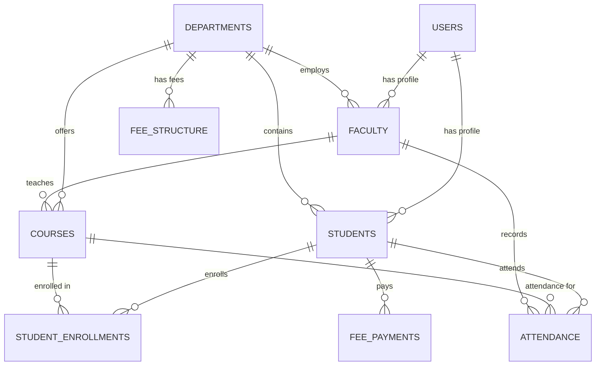

# 🎓 College ERP - Enterprise Resource Planning System

A comprehensive, professional College ERP (Enterprise Resource Planning) system built with Spring Boot, featuring modern web UI, JWT authentication, and complete academic management capabilities.


## 🌟 Features

### 🎯 **Core ERP Modules**
- **👥 Student Management**: Complete student lifecycle from admission to graduation
- **👨‍🏫 Faculty Management**: Faculty profiles, departments, and academic responsibilities  
- **📚 Course Management**: Course catalog, prerequisites, and curriculum management
- **🏢 Department Management**: Organizational structure and hierarchy
- **📊 Attendance Tracking**: Real-time attendance monitoring and reporting
- **💰 Fee Management**: Fee structures, payments, and financial tracking
- **📈 Analytics & Reports**: Comprehensive dashboards and reporting system

### 🔐 **Security & Authentication**
- **JWT Authentication**: Secure token-based authentication
- **Role-Based Access Control**: Admin, Faculty, Student, Staff roles
- **Password Encryption**: Secure password handling
- **Session Management**: Secure user session handling

### 🎨 **Professional Frontend**
- **Responsive Design**: Mobile-first, professional UI/UX
- **Modern Interface**: Bootstrap-styled components with animations
- **Dashboard**: Administrative dashboard with statistics and management
- **Real-time Updates**: Dynamic content and live data updates

## 🏗️ System Architecture

### 📋 **Entity Relationship Model**



### 🗃️ **Database Schema**

| Table | Description | Key Fields |
|-------|-------------|------------|
| **users** | Core user authentication | username, email, password, roles |
| **students** | Student profiles | roll_number, registration_number, cgpa |
| **faculty** | Faculty profiles | employee_id, designation, qualification |
| **departments** | Academic departments | code, name, head_of_department |
| **courses** | Course catalog | code, name, credits, prerequisites |
| **student_enrollments** | Course enrollments | student, course, grade, semester |
| **attendance** | Attendance records | student, course, date, status |
| **fee_structure** | Fee definitions | department, semester, amounts |
| **fee_payments** | Payment records | student, amount, payment_date |

## 🚀 Getting Started

### 📋 **Prerequisites**

- ☕ **Java 17+** (OpenJDK or Oracle JDK)
- 🔨 **Maven 3.6+** 
- 🌐 **Modern Web Browser**
- 💻 **Git** (for cloning)

### ⚡ **Quick Start**

1. **Clone the repository:**
   ```bash
   git clone https://github.com/AnasInaam/collage-erp.git
   cd collage-erp
   ```

2. **Build the project:**
   ```bash
   mvn clean compile
   ```

3. **Run the application:**
   ```bash
   mvn spring-boot:run
   ```

4. **Access the application:**
   - 🌐 **Main App**: http://localhost:8080
   - 📊 **Dashboard**: http://localhost:8080/dashboard.html
   - 🗃️ **Database Console**: http://localhost:8080/h2-console
   - 📖 **API Docs**: http://localhost:8080/swagger-ui.html

## 🌐 Application Access

### 🎯 **Main URLs**

| Service | URL | Description |
|---------|-----|-------------|
| **Home Page** | http://localhost:8080 | Professional landing page with auth |
| **Dashboard** | http://localhost:8080/dashboard.html | Administrative interface |
| **Database** | http://localhost:8080/h2-console | H2 database management |
| **API Docs** | http://localhost:8080/swagger-ui.html | Swagger API documentation |
| **Health Check** | http://localhost:8080/actuator/health | Application health status |

### 🔑 **Database Access**
- **JDBC URL**: `jdbc:h2:mem:testdb`
- **Username**: `SA`
- **Password**: (leave empty)

## 🛠️ API Endpoints

### 🔐 **Authentication APIs**
```bash
# User Registration
POST /api/auth/signup
Content-Type: application/json
{
  "username": "john.doe",
  "email": "john@college.edu",
  "password": "password123",
  "firstName": "John",
  "lastName": "Doe",
  "roles": ["STUDENT"]
}

# User Login
POST /api/auth/signin
Content-Type: application/json
{
  "username": "john.doe",
  "password": "password123"
}
```

### 📊 **Dashboard APIs**
```bash
# Get Dashboard Statistics
GET /api/dashboard/stats
Authorization: Bearer <jwt-token>

# Get Department Statistics
GET /api/dashboard/departments
Authorization: Bearer <jwt-token>
```

## 🏢 Project Structure

```
college-erp/
├── 📁 src/main/java/com/example/
│   ├── 🚀 springbootdemo/              # Main application package
│   │   ├── CollegeErpApplication.java  # Application entry point
│   │   ├── controller/                 # REST controllers
│   │   └── config/                     # Configuration classes
│   └── 🎓 collegeerp/                  # ERP core modules
│       ├── controller/                 # ERP controllers
│       ├── model/                      # Entity models
│       ├── repository/                 # Data repositories
│       ├── service/                    # Business logic
│       └── security/                   # Security configuration
├── 📁 src/main/resources/
│   ├── static/                         # Frontend assets
│   │   ├── index.html                  # Landing page
│   │   └── dashboard.html              # Admin dashboard
│   └── application.properties          # Configuration
├── 📁 src/test/                        # Test classes
├── 📄 pom.xml                          # Maven configuration
└── 📄 README.md                        # This file
```

## 🎨 Frontend Features

### ✨ **Professional UI Components**
- **🧭 Navigation Bar**: Responsive navbar with logo and menu
- **🎯 Hero Section**: Modern gradient header with call-to-action
- **👣 Footer**: Comprehensive footer with contact and links
- **🎭 Icons**: Font Awesome icon integration
- **📱 Responsive**: Mobile-first design with breakpoints
- **🔐 Auth Forms**: Professional registration and login forms
- **📊 Dashboard**: Administrative interface with statistics

### 🎮 **Interactive Features**
- **⚡ Real-time Status**: Server connectivity indicator
- **🔄 Dynamic Navigation**: Smooth section transitions
- **💫 Animations**: CSS3 animations and hover effects
- **🚨 Alerts**: Professional feedback and error handling
- **📊 Data Visualization**: Charts and statistics display

## 🔧 Configuration

### 🗃️ **Database Configuration**
```properties
# H2 Database (Development)
spring.datasource.url=jdbc:h2:mem:testdb
spring.datasource.username=SA
spring.datasource.password=
spring.h2.console.enabled=true

# JPA Configuration
spring.jpa.hibernate.ddl-auto=create-drop
spring.jpa.show-sql=true
```

### 🔐 **Security Configuration**
```properties
# JWT Configuration
college.app.jwtSecret=collegeSecretKey
college.app.jwtExpirationMs=86400000

# CORS Configuration
college.app.cors.allowedOrigins=http://localhost:3000
```

## 🚀 Deployment

### 📦 **Building for Production**
```bash
# Create production JAR
mvn clean package -DskipTests

# Run production build
java -jar target/spring-boot-demo-1.0.0.jar
```

### 🐳 **Docker Deployment** (Optional)
```dockerfile
FROM openjdk:17-jdk-slim
COPY target/spring-boot-demo-1.0.0.jar app.jar
EXPOSE 8080
ENTRYPOINT ["java", "-jar", "/app.jar"]
```

## 🛠️ Development

### 🧪 **Running Tests**
```bash
mvn test
```

### 🔍 **Code Quality**
```bash
mvn clean compile
mvn spring-boot:run
```

### 🐛 **Debugging**
- Enable debug mode: `mvn spring-boot:run -Dspring-boot.run.jvmArguments="-agentlib:jdwp=transport=dt_socket,server=y,suspend=n,address=5005"`
- Connect debugger to port 5005

## 💻 Technology Stack

### 🔧 **Backend Technologies**
- **🍃 Spring Boot 3.2.0**: Main framework
- **🗃️ Spring Data JPA**: Data persistence
- **🔐 Spring Security**: Authentication & authorization
- **🎯 JWT**: Token-based authentication
- **📊 H2 Database**: In-memory database (development)
- **🔨 Maven**: Build and dependency management

### 🎨 **Frontend Technologies**
- **🌐 HTML5/CSS3**: Modern web standards
- **⚡ JavaScript (ES6+)**: Interactive functionality
- **🎭 Font Awesome**: Professional icons
- **📱 Responsive Design**: Mobile-first approach
- **💫 CSS3 Animations**: Smooth user experience

## 👥 Contributing

1. **🍴 Fork the repository**
2. **🌿 Create a feature branch**: `git checkout -b feature/amazing-feature`
3. **💾 Commit changes**: `git commit -m 'Add amazing feature'`
4. **📤 Push to branch**: `git push origin feature/amazing-feature`
5. **🔄 Open a Pull Request**

## 📄 License

This project is licensed under the MIT License - see the [LICENSE](LICENSE) file for details.

## 📞 Contact & Support

- **👨‍💻 Developer**: Anas Inaam
- **📧 Email**: [your-email@example.com]
- **🐙 GitHub**: [@AnasInaam](https://github.com/AnasInaam)
- **🌐 Repository**: [collage-erp](https://github.com/AnasInaam/collage-erp)

## 🙏 Acknowledgments

- **Spring Boot Team** for the excellent framework
- **Font Awesome** for the icon library
- **H2 Database** for development convenience
- **JWT.io** for token authentication standards

---

⭐ **If you find this project helpful, please give it a star!** ⭐
