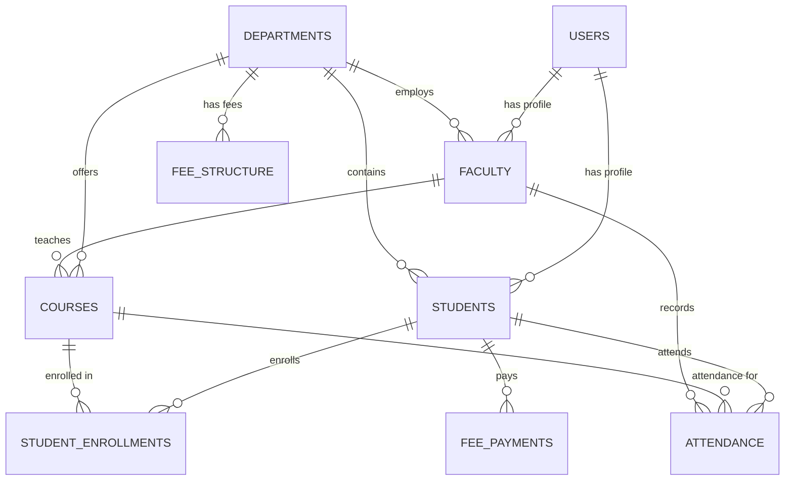

# 🎓 College ERP - Enterprise Resource Planning System

A comprehensive, professional College ERP (Enterprise Resource Planning) system built with Spring Boot, featuring modern web UI, JWT authentication, and complete academic management capabilities with **Supabase PostgreSQL** database.


## 🌟 Features

### 🎯 **Core ERP Modules**
- **👥 Student Management**: Complete student lifecycle from admission to graduation
- **👨‍🏫 Faculty Management**: Faculty profiles, departments, and academic responsibilities  
- **📚 Course Management**: Course catalog, prerequisites, and curriculum management
- **🏢 Department Management**: Organizational structure and hierarchy
- **📊 Attendance Tracking**: Real-time attendance monitoring and reporting
- **💰 Fee Management**: Fee structures, payments, and financial tracking
- **📈 Analytics & Reports**: Comprehensive dashboards and reporting system

### 🔐 **Security & Authentication**
- **JWT Authentication**: Secure token-based authentication
- **Role-Based Access Control**: Admin, Faculty, Student, Staff roles
- **Password Encryption**: Secure password handling
- **Session Management**: Secure user session handling

### 🎨 **Professional Frontend**
- **Responsive Design**: Mobile-first, professional UI/UX
- **Modern Interface**: Bootstrap-styled components with animations
- **Dashboard**: Administrative dashboard with statistics and management
- **Real-time Updates**: Dynamic content and live data updates

## 🏗️ System Architecture

### 📋 **Entity Relationship Model**



### 🗃️ **Database Schema**

| Table | Description | Key Fields |
|-------|-------------|------------|
| **users** | Core user authentication | username, email, password, roles |
| **students** | Student profiles | roll_number, registration_number, cgpa |
| **faculty** | Faculty profiles | employee_id, designation, qualification |
| **departments** | Academic departments | code, name, head_of_department |
| **courses** | Course catalog | code, name, credits, prerequisites |
| **student_enrollments** | Course enrollments | student, course, grade, semester |
| **attendance** | Attendance records | student, course, date, status |
| **fee_structure** | Fee definitions | department, semester, amounts |
| **fee_payments** | Payment records | student, amount, payment_date |

## 🚀 Getting Started

### 📋 **Prerequisites**

- ☕ **Java 17+** (OpenJDK or Oracle JDK)
- 🔨 **Maven 3.6+** 
- 🌐 **Modern Web Browser**
- 💻 **Git** (for cloning)
- 🗄️ **Supabase Account** (for PostgreSQL database)

### ⚡ **Quick Start**

1. **Clone the repository:**
   ```bash
   git clone https://github.com/AnasInaam/collage-erp.git
   cd collage-erp
   ```

2. **Set up Supabase PostgreSQL:**
   - Create a [Supabase](https://supabase.com) account
   - Create a new project
   - Get your database connection details from Settings → Database
   - Update `application-dev.properties` with your credentials (or use environment variables)

3. **Configure Environment (Optional):**
   ```bash
   # For production deployment
   export DATABASE_URL=your_supabase_connection_url
   export DB_USERNAME=postgres
   export DB_PASSWORD=your_password
   export JWT_SECRET=your_jwt_secret
   ```

4. **Build the project:**
   ```bash
   mvn clean compile
   ```

5. **Run the application:**
   ```bash
   # Development mode with Supabase PostgreSQL
   .\run.ps1 dev
   
   # OR use Maven directly
   mvn spring-boot:run "-Dspring-boot.run.profiles=dev"
   
   # OR with H2 fallback for local development
   .\run.ps1 dev-h2
   ```

6. **Access the application:**
   - 🌐 **Main App**: http://localhost:8080
   - 📊 **Dashboard**: http://localhost:8080/dashboard.html
   - � **API Docs**: http://localhost:8080/swagger-ui.html
   - 🏥 **Health Check**: http://localhost:8080/actuator/health

## 🌐 Application Access

### 🎯 **Main URLs**

| Service | URL | Description |
|---------|-----|-------------|
| **Home Page** | http://localhost:8080 | Professional landing page with auth |
| **Dashboard** | http://localhost:8080/dashboard.html | Administrative interface |
| **API Docs** | http://localhost:8080/swagger-ui.html | Swagger API documentation |
| **Health Check** | http://localhost:8080/actuator/health | Application health status |

### 🔑 **Default Login Credentials**
| Role | Username | Password |
|------|----------|----------|
| **Admin** | `admin` | `admin123` |
| **Student** | `student` | `student123` |
| **Faculty** | `faculty` | `faculty123` |

### 🗄️ **Database Access**
- **Provider**: Supabase PostgreSQL
- **Environment**: Production-ready cloud database
- **Auto-DDL**: Tables created automatically from JPA entities
- **Connection Pooling**: HikariCP for optimal performance

## 🛠️ API Endpoints

### 🔐 **Authentication APIs**
```bash
# User Registration
POST /api/auth/signup
Content-Type: application/json
{
  "username": "john.doe",
  "email": "john@college.edu",
  "password": "password123",
  "firstName": "John",
  "lastName": "Doe",
  "roles": ["STUDENT"]
}

# User Login
POST /api/auth/signin
Content-Type: application/json
{
  "username": "john.doe",
  "password": "password123"
}
```

### 📊 **Dashboard APIs**
```bash
# Get Dashboard Statistics
GET /api/dashboard/stats
Authorization: Bearer <jwt-token>

# Get Department Statistics
GET /api/dashboard/departments
Authorization: Bearer <jwt-token>
```

## 🏢 Project Structure

```
college-erp/
├── 📁 src/main/java/com/example/
│   ├── 🚀 springbootdemo/              # Main application package
│   │   ├── CollegeErpApplication.java  # Application entry point
│   │   ├── controller/                 # Basic controllers
│   │   └── config/                     # Configuration classes
│   └── 🎓 collegeerp/                  # ERP core modules
│       ├── controller/                 # REST API controllers
│       ├── model/                      # JPA entity models
│       ├── repository/                 # Data repositories
│       ├── service/                    # Business logic services
│       ├── security/                   # Security configuration
│       └── dto/                        # Data transfer objects
├── 📁 src/main/resources/
│   ├── static/                         # Frontend assets
│   │   ├── index.html                  # Landing page
│   │   └── dashboard.html              # Admin dashboard
│   ├── application.properties          # Main configuration
│   ├── application-dev.properties      # Development profile
│   ├── application-dev-h2.properties   # H2 fallback profile
│   ├── application-prod.properties     # Production profile
│   └── application-test.properties     # Test profile
├── 📁 src/test/                        # Test classes
├── 📁 target/                          # Build output (ignored)
├── 📄 pom.xml                          # Maven configuration
├── 📄 README.md                        # This comprehensive guide
├── 📄 CONTRIBUTING.md                  # Contribution guidelines
├── 📄 CHANGELOG.md                     # Version history
├── 📄 LICENSE                          # MIT license
├── 📄 .gitignore                       # Git ignore rules
├── 🔧 run.ps1                          # PowerShell run script
├── 🔧 run.bat                          # Batch run script
├── 🔧 setup-env-template.ps1           # Environment setup template
├── 📚 TROUBLESHOOTING.md               # Network and setup issues
├── 📚 COMMAND_REFERENCE.md             # Command usage guide
├── 📚 MIGRATION_COMPLETE.md            # H2 to PostgreSQL migration log
├── 📚 RENDER_DEPLOYMENT_GUIDE.md       # Cloud deployment guide
├── 📚 POSTGRESQL_SETUP.md              # Database setup instructions
└── 📚 QUICK_START.md                   # Quick reference guide
```

## 🎨 Frontend Features

### ✨ **Professional UI Components**
- **🧭 Navigation Bar**: Responsive navbar with logo and menu
- **🎯 Hero Section**: Modern gradient header with call-to-action
- **👣 Footer**: Comprehensive footer with contact and links
- **🎭 Icons**: Font Awesome icon integration
- **📱 Responsive**: Mobile-first design with breakpoints
- **🔐 Auth Forms**: Professional registration and login forms
- **📊 Dashboard**: Administrative interface with statistics

### 🎮 **Interactive Features**
- **⚡ Real-time Status**: Server connectivity indicator
- **🔄 Dynamic Navigation**: Smooth section transitions
- **💫 Animations**: CSS3 animations and hover effects
- **🚨 Alerts**: Professional feedback and error handling
- **📊 Data Visualization**: Charts and statistics display

## 🔧 Configuration

### �️ **Database Configuration**

#### **Supabase PostgreSQL (Default)**
```properties
# Supabase PostgreSQL Configuration
spring.datasource.url=jdbc:postgresql://db.projectref.supabase.co:5432/postgres?sslmode=require&preferQueryMode=simple
spring.datasource.username=postgres
spring.datasource.password=your_password
spring.datasource.driver-class-name=org.postgresql.Driver

# JPA Configuration
spring.jpa.database-platform=org.hibernate.dialect.PostgreSQLDialect
spring.jpa.hibernate.ddl-auto=update
spring.jpa.show-sql=true
```

#### **H2 Database (Development Fallback)**
```properties
# H2 Database (Development Fallback)
spring.datasource.url=jdbc:h2:mem:testdb
spring.datasource.username=SA
spring.datasource.password=
spring.h2.console.enabled=true

# JPA Configuration
spring.jpa.hibernate.ddl-auto=create-drop
spring.jpa.show-sql=true
```

### 🔐 **Security Configuration**
```properties
# JWT Configuration
app.jwt.secret=your_jwt_secret_key
app.jwt.expiration=86400000

# CORS Configuration (if needed)
cors.allowed.origins=http://localhost:3000
```

### 🏃‍♂️ **Profile Configuration**

The application supports multiple profiles:

| Profile | Database | Use Case |
|---------|----------|----------|
| **dev** | Supabase PostgreSQL | Development with cloud DB |
| **dev-h2** | H2 In-Memory | Local development fallback |
| **prod** | Supabase PostgreSQL | Production deployment |
| **test** | Supabase PostgreSQL | Testing environment |

**Run with specific profile:**
```bash
# Development with Supabase
.\run.ps1 dev

# Development with H2 fallback
.\run.ps1 dev-h2

# Production
.\run.ps1 prod

# Tests
.\run.ps1 test
```

## 🚀 Deployment

### 📦 **Building for Production**
```bash
# Build with Maven
mvn clean package -DskipTests

# Run production build
java -jar target/spring-boot-demo-1.0.0.jar

# OR use run script
.\run.ps1 build
```

### ☁️ **Cloud Deployment**

#### **Render Deployment**
1. **Connect GitHub repository** to Render
2. **Create Web Service** with these settings:
   - **Build Command**: `mvn clean package -DskipTests`
   - **Start Command**: `java -jar target/spring-boot-demo-1.0.0.jar`
3. **Set Environment Variables**:
   ```
   DATABASE_URL=your_supabase_internal_url
   DB_USERNAME=postgres
   DB_PASSWORD=your_password
   JWT_SECRET=your_strong_jwt_secret
   SPRING_PROFILES_ACTIVE=prod
   ```

#### **Heroku Deployment**
```bash
# Create Heroku app
heroku create your-college-erp

# Set environment variables
heroku config:set DATABASE_URL=your_supabase_url
heroku config:set SPRING_PROFILES_ACTIVE=prod

# Deploy
git push heroku main
```

### 🐳 **Docker Deployment**
```dockerfile
FROM openjdk:17-jdk-slim
COPY target/spring-boot-demo-1.0.0.jar app.jar
EXPOSE 8080
ENV SPRING_PROFILES_ACTIVE=prod
ENTRYPOINT ["java", "-jar", "/app.jar"]
```

**Build and run:**
```bash
docker build -t college-erp .
docker run -p 8080:8080 \
  -e DATABASE_URL=your_supabase_url \
  -e DB_USERNAME=postgres \
  -e DB_PASSWORD=your_password \
  college-erp
```

## 🛠️ Development

### 🧪 **Running Tests**
```bash
# Run all tests
mvn test

# Run with specific profile
mvn test -Dspring.profiles.active=test

# Using run script
.\run.ps1 test
```

### 🔍 **Code Quality**
```bash
# Compile and check for errors
mvn clean compile

# Run application in debug mode
mvn spring-boot:run -Dspring-boot.run.jvmArguments="-agentlib:jdwp=transport=dt_socket,server=y,suspend=n,address=5005"
```

### 🐛 **Debugging**
- **Debug Port**: 5005
- **Connect IDE debugger** to localhost:5005
- **Log Levels**: Configurable in application.properties

### 📝 **Available Run Scripts**

| Command | Description |
|---------|-------------|
| `.\run.ps1 dev` | Development mode with Supabase |
| `.\run.ps1 dev-h2` | Development mode with H2 fallback |
| `.\run.ps1 prod` | Production mode |
| `.\run.ps1 test` | Run unit tests |
| `.\run.ps1 build` | Build JAR file |

### 🔧 **Troubleshooting**

#### **PowerShell Execution Policy**
```powershell
Set-ExecutionPolicy -ExecutionPolicy RemoteSigned -Scope CurrentUser
```

#### **Maven Not Found**
```powershell
$env:PATH += ";C:\apache-maven-3.9.11\bin"
```

#### **Port Already in Use**
```powershell
# Find process using port 8080
netstat -ano | findstr :8080

# Kill process (replace XXXX with PID)
taskkill /PID XXXX /F
```

#### **Database Connection Issues**
1. **Check Supabase connection string**
2. **Verify network connectivity**: `Test-NetConnection db.projectref.supabase.co -Port 5432`
3. **Use H2 fallback**: `.\run.ps1 dev-h2`
4. **Check firewall settings**

## 💻 Technology Stack

### 🔧 **Backend Technologies**
- **🍃 Spring Boot 3.2.0**: Main framework with auto-configuration
- **�️ Spring Data JPA**: Data persistence and repository pattern
- **🔐 Spring Security**: Authentication & authorization with JWT
- **🎯 JWT (jsonwebtoken)**: Stateless token-based authentication
- **� PostgreSQL**: Production-grade relational database
- **☁️ Supabase**: Cloud PostgreSQL hosting and management
- **🏊‍♂️ HikariCP**: High-performance connection pooling
- **�📊 H2 Database**: In-memory database for development fallback
- **🔨 Maven**: Build automation and dependency management
- **📖 Swagger/OpenAPI**: API documentation and testing

### 🎨 **Frontend Technologies**
- **🌐 HTML5/CSS3**: Modern semantic markup and styling
- **⚡ JavaScript (ES6+)**: Interactive functionality and DOM manipulation
- **🎭 Font Awesome**: Professional icon library
- **📱 Responsive Design**: Mobile-first CSS with media queries
- **💫 CSS3 Animations**: Smooth transitions and hover effects
- **🎨 Bootstrap**: CSS framework for rapid UI development

### ☁️ **Cloud & Deployment**
- **🚀 Supabase**: PostgreSQL database hosting
- **🌐 Render**: Web application hosting (recommended)
- **⚡ Heroku**: Alternative cloud deployment
- **🐳 Docker**: Containerization support
- **🔄 CI/CD**: GitHub Actions ready

### 🛠️ **Development Tools**
- **📝 VS Code**: Recommended IDE with Spring Boot extensions
- **🔧 Maven Wrapper**: Project-specific Maven version
- **🧪 JUnit 5**: Unit testing framework
- **📊 Spring Boot Actuator**: Production monitoring and metrics
- **🔍 Spring Boot DevTools**: Hot reload and development utilities

## 👥 Contributing

1. **🍴 Fork the repository**
2. **🌿 Create a feature branch**: `git checkout -b feature/amazing-feature`
3. **💾 Commit changes**: `git commit -m 'Add amazing feature'`
4. **📤 Push to branch**: `git push origin feature/amazing-feature`
5. **🔄 Open a Pull Request**

## 📄 License

This project is licensed under the MIT License - see the [LICENSE](LICENSE) file for details.

## 📞 Contact & Support

- **👨‍💻 Developer**: Anas Inaam
- **📧 Email**: [anasprog99@gmail.com](mailto:anasprog99@gmail.com)
- **🐙 GitHub**: [@AnasInaam](https://github.com/AnasInaam)
- **🌐 Repository**: [collage-erp](https://github.com/AnasInaam/collage-erp)
- **💬 Issues**: [GitHub Issues](https://github.com/AnasInaam/collage-erp/issues)
- **📖 Documentation**: See [docs/](docs/) folder for detailed documentation

## 🙏 Acknowledgments

- **☕ Spring Boot Team** for the excellent framework and ecosystem
- **🐘 PostgreSQL Team** for the robust database system
- **☁️ Supabase** for the managed PostgreSQL hosting
- **🎭 Font Awesome** for the comprehensive icon library
- **📊 H2 Database** for development convenience
- **🔐 JWT.io** for token authentication standards
- **🎨 Bootstrap** for the responsive CSS framework
- **🔧 Maven** for build automation and dependency management

## 📝 Additional Resources

- **📚 [Spring Boot Documentation](https://spring.io/projects/spring-boot)**
- **🐘 [PostgreSQL Documentation](https://www.postgresql.org/docs/)**
- **☁️ [Supabase Documentation](https://supabase.com/docs)**
- **🔐 [JWT Introduction](https://jwt.io/introduction/)**
- **📖 [API Documentation](http://localhost:8080/swagger-ui.html)** (when running locally)

## 🗓️ Project Status

- **✅ Current Version**: 1.0.0
- **🚀 Status**: Production Ready
- **🔄 Last Updated**: September 2025
- **🛠️ Maintenance**: Active Development
- **📈 Next Features**: Mobile app, advanced analytics, integration APIs

---

⭐ **If you find this project helpful, please give it a star!** ⭐

🔄 **Keep your fork updated** by syncing with the main repository.

📢 **Follow for updates** and new features!
